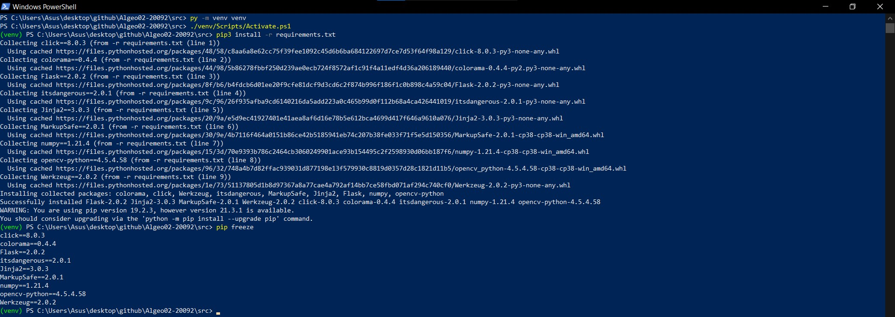
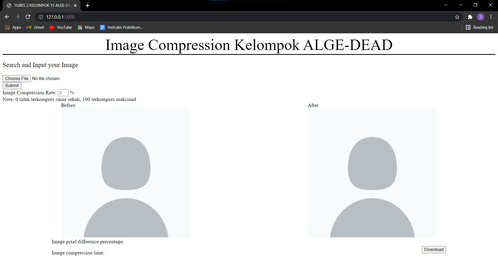
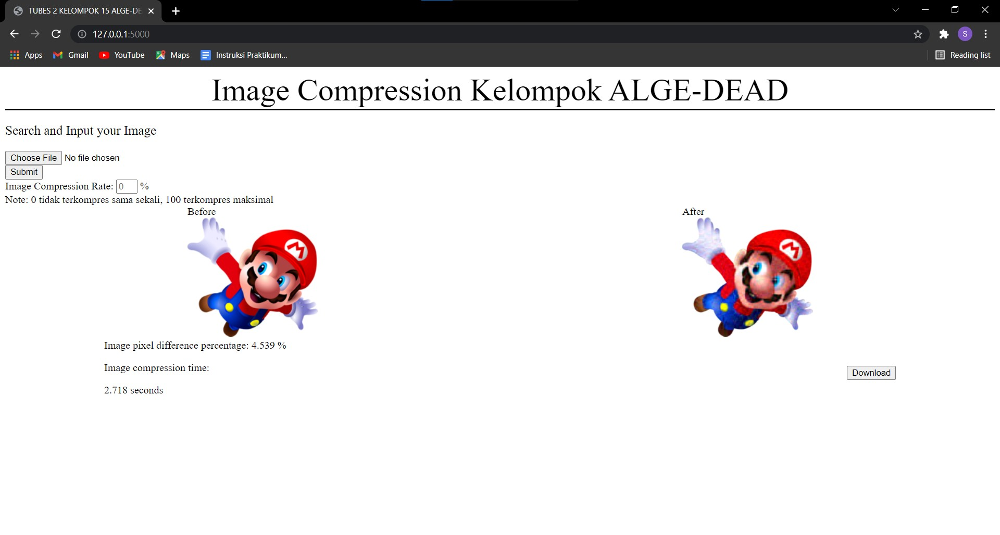

# Tugas Besar 2 IF2123 Aljabar Linier dan Geometri

> Membuat website yang dihost pada lokal yang dapat menerima inputan berupa foto dan persentase kompresi yang diinginkan lalu menghasilkan foto yang terkompres sesuai input yang diberikan pengguna yang di mana foto tersebut dapat di-download oleh pengguna

## Daftar Anggota Kelompok

<table>

<tr><td colspan = 3 align = "center">KELOMPOK 15 ALGE-DEAD</td></tr>
<tr><td>No.</td><td>Nama</td><td>NIM</td></tr>
<tr><td>1.</td><td>Vieri Mansyl</td><td>13520092</td></tr>
<tr><td>2.</td><td>Vincent Prasetiya Atmadja</td><td>13520099</td></tr>
<tr><td>3.</td><td>Steven</td><td>13520131</td></tr>

</table>

## Teknologi dan Library yang Digunakan
* HTML
* CSS
* Python 3.8.0
    * click 8.0.3
    * colorama 0.4.4
    * Flask 2.0.2
    * itsdangerous 2.0.1
    * Jinja2 3.0.3
    * MarkupSafe 2.0.1
    * numpy 1.21.4
    * opencv-python 4.5.4.58
    * Werkzeug 2.0.2

## Cara Memakai

1. Download atau clone repo ini
2. Jalankan Windows PowerShell
3. Buka folder src repo ini
4. Buat Virtual Environment Python

    ```bash
    py -m venv venv
    ./venv/Scripts/Activate.ps1
    ```

5. Install library yang akan digunakan

    ```bash
    pip3 install -r requirements.txt
    ```

6. Pastikan library yang telah diinstall sudah sesuai

    ```bash
    pip freeze
    ```

7. Jalankan program

    ```bash
    flask run
    ```

8. Copy IP address dan port yang tertera pada Windows PowerShell
    <br/>
    <br/>
    Misalnya Tertera:

    ```bash
    * Environment: production
    WARNING: This is a development server. Do not use it in a production deployment.
    Use a production WSGI server instead.
    * Debug mode: off
    * Running on http://127.0.0.1:5000/ (Press CTRL+C to quit)
    ```

    Yang dicopy:
    `http://127.0.0.1:5000/`
    <br/>
    <br/>

9. Paste hasil copy-an tersebut pada browser

<br/>
<br/>

## Tampilan Cara Set-Up Virtual Environtment dan Download Library pada Windows PowerShell



## Tampilan Awal Pada Localhost



## Tampilan Setelah Memilih File, Mengisi Image Compression Rate, dan Menekan Tombol Submit



## Ucapan Terima Kasih

Kami mengucapkan terima kasih kepada

* Dr. Judhi S. Santoso (Dosen K1 IF2123 Tahun 2021/2022)
* Dr. Rinaldi Munir (Dosen K2 IF2123 Tahun 2021/2022)
* Dr. Rila Mandala (Dosen K3 IF2123 Tahun 2021/2022)
* Semua Asisten IF2123 Tahun 2021/2022
